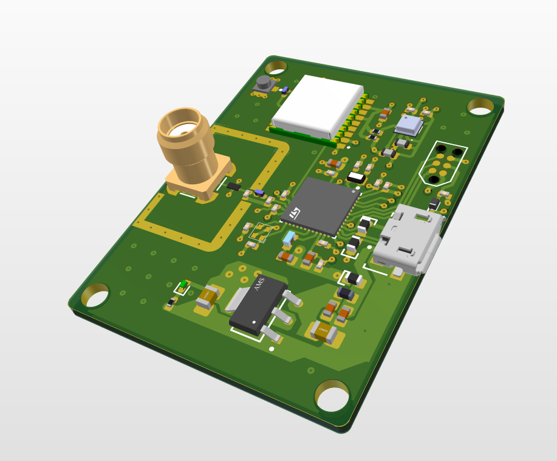

Volatile organic compounds mesurement unit designed in Altium. The circuit allows bluetooth communication and measuring position with gnss ATGM336H module. The design files can also be viewed on Altium 365:
 
Schematic: https://365.altium.com/files/3B2ECBF3-EEB1-4115-A986-FD56A393E7B7
 
PCB layout: https://365.altium.com/files/D3AF03CD-3467-4042-AEBF-ECEB7C44DFD2
 
PCB image:

 
This board uses an i2c protocol to communicate with BME688 sensor and standard uart for gps. The projects follows the practices to reduce EMI, espacially as it contains RF components.

